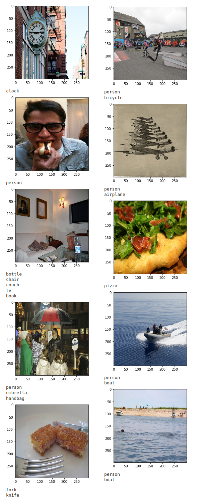

# multi-label-image-classifier
A multi-label image classifier repository based on InceptionResNetV2.

# Examples

# Train
To get the sense of the architecture of the model and the training procedure, check out the [Labeling-Jupyter-main](Labeling-Jupyter-main.ipynb) file.

# Inference
In order to inference, first save the trained model via [Labeling-Jupyter-main](Labeling-Jupyter-main.ipynb) and then check out the [Inference-Labeling-Jupyter](Inference-Labeling-Jupyter.ipynb) file.
